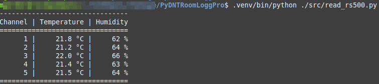

# MyDNTRoomLoggPro

This repository is forked from [Churro405](https://github.com/Churro405/dnt_Weatherstation).

## Setup

### Unplug the dnt RoomLogg Pro device

If plugged, it will apparently not work. Don't ask why...

### Install System Packages

Install following packages.

Basics:

```shell
sudo apt install python3
sudo apt install python3-virtualenv
sudo apt install python3-pip-whl
```

Specifics for this project:

```shell
sudo apt install python3-dev
sudo apt install libusb-1.0-0-dev libudev-dev
sudo apt install libhidapi-hidraw0
sudo apt install libhidapi-libusb0
```

### Create UDev Rule.

To allow a normal user to access the device, create a udev rule file.

The file name is important, says Churro405.

`sudo vim /etc/udev/rules.d/91-hid.rules`

File contents.

`SUBSYSTEM=="usb", ATTR{idVendor}=="0483", ATTR{idProduct}=="5750", MODE="0666"` 

Reboot the Raspberry Pi to apply the configuration.

### Create the Python Virtual Environment

To prevent polluting your system with Python packages only necessary for this tool, create a virtual environment.

```shell
python -m venv .venv
source .venv/bin/activate
python -m pip install pip --upgrade
pip install setuptools --upgrade
pip install hidapi
```

Scripts can be run either by activating the virtual environment with the `source .venv/bin/activate`
or by calling the Python binary in the virtual environment folder `./.venv/bin/python ./src/read_rs500.py`.

A virtual environment can be `deactivate`d.

### Test the Setup

`./.venv/bin/python ./src/read_rs500.py`


